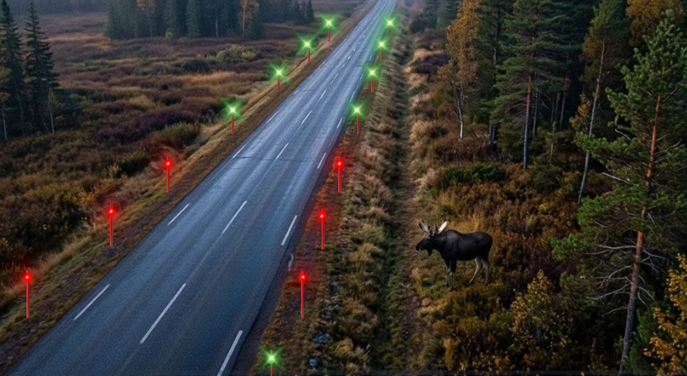
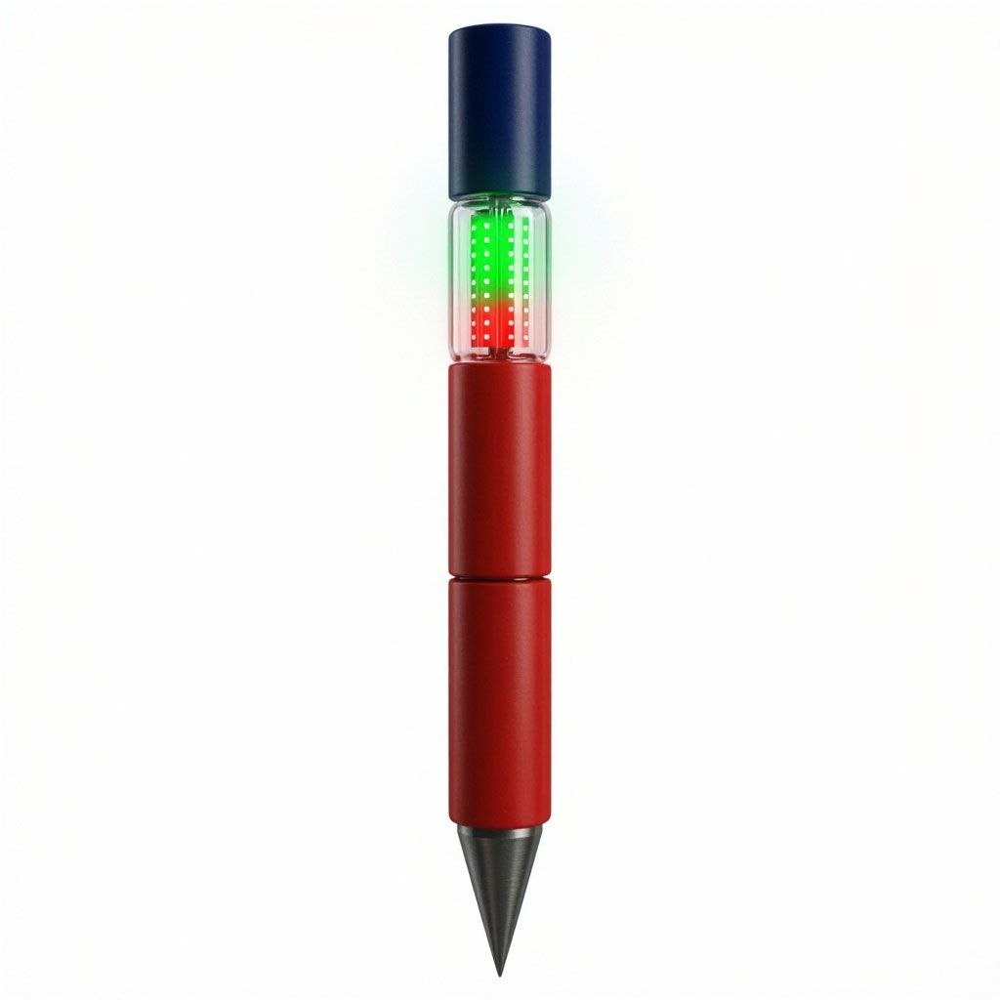
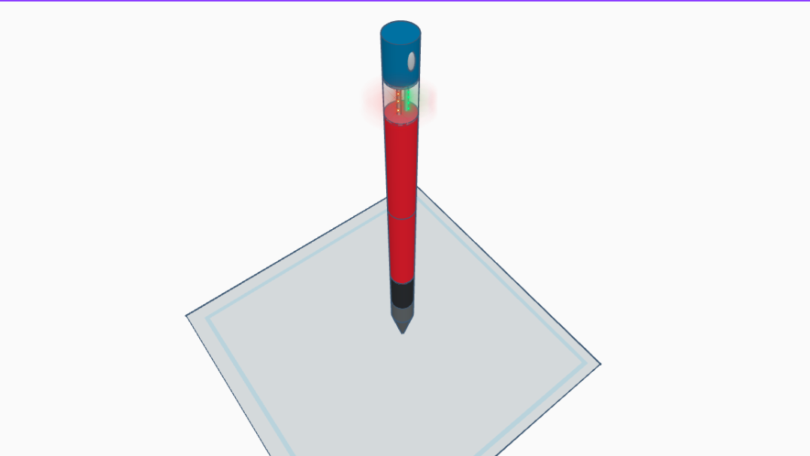

🌲 Älyviitta (Smart Auraviitta) — Open Hardware Road Safety Infrastructure

Pohjoinen Aloite (Northern Initiative)

Dedicated to Finland, Sweden, Norway, and All Northern Lands • 2026

Author & Concept Creator: Roman Kemov

License: Creative Commons Attribution-ShareAlike 4.0 International (CC BY-SA 4.0)

https://github.com/user-attachments/assets/ab0929df-a242-4b3e-91b3-f853696e8a3a

### 📐 Hardware Design & 3D Renders

*Figure 1: Full-length 3D model with ground anchor. Figure 2: Close-up of the 6-section optical & sensor head with LEDs.*

## Technical Specification v1.0
Älyviitta is an open-source concept for a distributed, wireless mesh network of intelligent roadside beacons acting as an active fence. It is designed for the early warning of drivers about wildlife like moose and reindeer entering the roadway on regional and national highways, effectively preventing collisions.

——————————

1. Installation Scheme and Network Topology (Mesh)

The system is installed on the roadside along both sides of the road and consists of two types of devices.

Standard Slave Beacons make up 90% of the network and are spaced every 20 meters. Their primary function is to receive radio alarm signals and instantly activate visual indicators.

Master Beacons make up 10% of the network and are placed every 100 meters at every fifth pole. They are equipped with thermal imaging sensor units to detect animals approaching from the forest.

To eliminate blind spots, each Master beacon features an infrared sensor with a 120-degree field of view directed toward the forest edge. The 100-meter spacing ensures that the detection zones of adjacent Master beacons overlap by 50 percent, providing complete redundancy.

In addition, a built-in motion sensor works to detect animals, and an ambient light sensor allows the system to seamlessly switch between day and night modes.

——————————

2. 6-Section Modular Architecture (Flush Thread)

Each beacon is a slim, smooth cylinder with a diameter of 25 mm and a length between 1.2 and 1.5 meters. All sections are connected using internal flush threading with a long pitch of 15 to 30 turns, making the exterior completely smooth and structurally robust.

Section 6 is the top solar cap featuring a 360-degree flexible CIGS solar sleeve. On Master beacons, this section also integrates a flush-mounted Grid-EYE 8x8 thermal imager, motion sensors, an ambient light sensor, and an NB-IoT or LTE-M cellular chip.

Section 5 is the optical sleeve consisting of a transparent polycarbonate tube housing directional dual-sided RGB LED arrays for green and red illumination.

Section 4 is the electronic brain, which is a sealed red plastic module containing the main microcontroller and an 868 MHz Sub-GHz Mesh radio chip.

Section 3 is the battery core made of a reinforced red plastic tube housing a 1-meter long low-temperature LiFePO4 battery rated down to minus 40 degrees Celsius. This battery doubles as the internal structural spine for the beacon.

Section 2 is a flexible insert containing a monolithic polyurethane joint-damper. It allows the beacon to bend 45 to 90 degrees under the impact of snowplows like Lumiauto and instantly snap back to the vertical position.

Section 1 is the anchor, consisting of a pointed high-strength composite ground socket designed for driving directly into frozen soil.

For internal connectivity, concentric copper contact rings and spring-loaded Pogo Pins are embedded inside the threaded ends between sections 6, 5, 4, and 3. Assembly is entirely toolless, simply screwing together by hand to complete the circuit. Waterproofing is guaranteed by silicone O-rings rated to IP68.

——————————

3. Intelligent Operating Modes and Energy Saving
 During night and twilight mode when no animals are detected, all beacons glow with a soft green light to form a visible safety corridor and improve road visibility during blizzards and polar nights.

When an animal is detected, the nearest Master beacon locks onto the thermal signature defined by a mass over 100 kilograms and a height over 1.2 meters. It broadcasts an alarm via the Mesh network, causing all beacons within a 200 to 500-meter radius to switch to a one-hertz pulsing bright red alarm.

During daytime mode when no animals are present, green LEDs are turned off to conserve energy while infrared sensors remain active 24/7 in micro-power mode.

When an animal is detected during the day, the system instantly triggers the one-hertz pulsing bright red alarm in a local 200-meter zone spanning five beacons in each direction around the entry point.

*(Note on extreme energy efficiency: The system architecture allows for the future implementation of a **Dynamic Green Wave** mode. In this mode, the green safety corridor remains in Deep Sleep and activates only 1 km ahead of an approaching vehicle, turning off immediately after it passes. This is achieved through pre-timed mesh-packet propagation triggered by Super-Master nodes at major road junctions, minimizing battery drain during polar nights).*

4. Telemetry and  Self-Diagnostics

To eliminate manual inspections by road authorities such as Väylävirasto or Destia, Älyviitta uses an automated self-diagnostic protocol.

Every day at noon, each Master beacon sends a one-millisecond radio query to its group of Slave beacons.

Each Slave beacon immediately replies with its health status, such as battery percentage or LED warnings.

The Master beacon aggregates this data and transmits a concise report to the cloud of the road authority via the NB-IoT or LTE-M cellular modem.

Operators at the control center can view exact coordinates on a map, allowing a technician to drive to the precise location, replace a single module within 30 seconds, and eliminate unnecessary operational costs.

——————————

5. Survival Physics in Northern Conditions

During the polar night or Kaamos, the vertical 360-degree CIGS panel collects diffuse ambient light even under low sun angles. The reserve capacity of the LiFePO4 battery provides 45 to 60 days of continuous autonomous operation in complete darkness.

To protect against ice and snow, the optical sleeve features a hydrophobic coating that allows wet snow to slide off easily under its own weight and the micro-vibrations caused by passing traffic.

Although IP68 O-rings and breathable membranes are built in, the final anti-condensation strategy will be fully validated during field testing across temperature drops from plus 5 to minus 30 degrees Celsius.

System autonomy of 45 to 60 days is theoretically calculated and will be finally confirmed through field trials conducted in sub-arctic conditions.

——————————

6. Project Economics (BOM)

The estimated series production cost is approximately 20 Euros for a Slave beacon and 41 Euros for a Master beacon.

The total infrastructure cost for one kilometer of highway equipped with 100 beacons on both sides is approximately 2,210 Euros.

For comparison, traditional metal or mesh moose fencing typically costs between 30,000 and 50,000 Euros per kilometer.

——————————

Open for international engineering collaboration, university research, and municipal road safety pilots.

